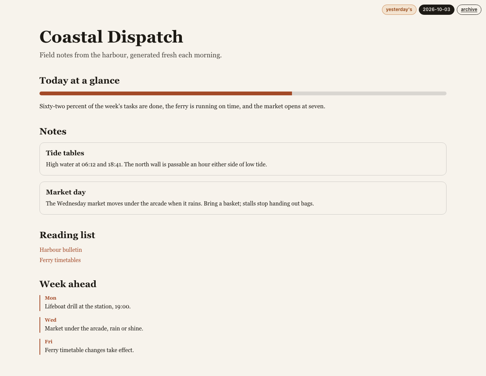
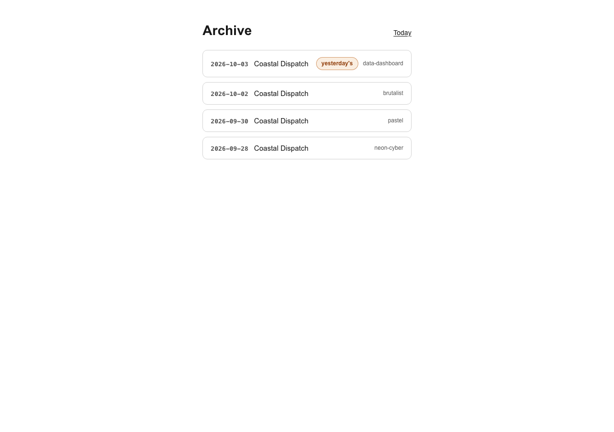
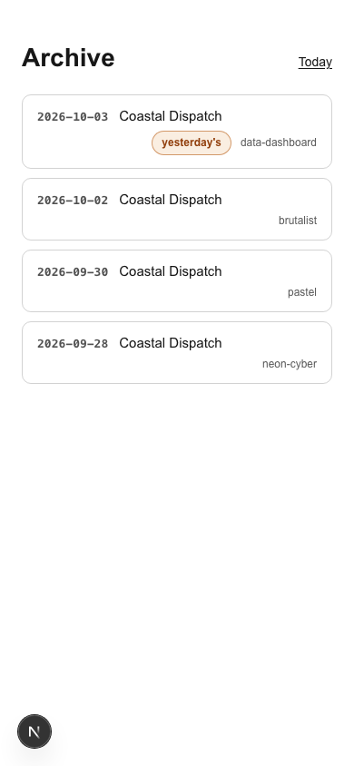

# Daily UI

An LLM designs a random interface every day. The output is not trusted: it must
survive a Zod schema, a depth/node budget, and a repair attempt before it is
allowed anywhere near a render. Every accepted design is stored, so the archive
is a growing gallery of machine-made UIs.

Visitors can also describe a UI of their own and see it rendered — the preview
box on `/` asks for a short brief, calls the same generation pipeline, and shows
the result through the same renderer in its own region below today's document.
A preview is never stored, never archived, and leaves the daily document
untouched.



<sub>Rendered from the e2e fixture (`tests/fixtures/sample-doc.json`), so this
screenshot is reproducible without an API key.</sub>

## How a day gets made

```
directive (deterministic per date)
  → prompt: registry inventory + LIMITS + theme brief + date + "JSON only"
  → provider (OpenAI structured output / Anthropic tool use)
  → extractJson → validateDocument          ← untrusted input gate
      ├─ valid ............ store as today's UI
      ├─ invalid ......... ONE repair attempt (prior output + first errors)
      │                     ├─ valid ... store
      │                     └─ invalid → reuse the previous day's document, badge it "yesterday's"
      └─ provider failed → same fallback; nothing older → GenerationError
```

Stored days have two entry points — the CLI and the HTTP route — and both call
the same `generateDay()` in `lib/generate.ts`. There is no second code path.

Visitor previews are the third, and they are not a path around the gate:
`POST /api/preview` calls `generateFromBrief()` in the same file, so a brief
goes through the same Zod validation, budget and single repair attempt. Only the
prompt differs, and nothing is written to the database.

If today's row is missing when someone opens `/` or `GET /api/today`, the server
makes **one** generation attempt with server-held credentials, rate-limited to
once per date per 10 minutes, then falls back to the latest stored day with a
"showing most recent" badge. A fresh deploy with an empty database fills itself
on first visit.

## Quick start

```bash
npm install
cp .env.example .env.local     # then fill in LLM_PROVIDER + LLM_API_KEY
npm run dev                    # http://localhost:3000
```

Generate a day by hand (this is what a cron job would call):

```bash
LLM_PROVIDER=openai LLM_API_KEY=sk-... npx tsx scripts/generate.ts --from 2026-10-03 --to 2026-10-03
# → 2026-10-03 ok
```

Backfill a range with `--from`/`--to`; both default to today. The script prints
`<date> ok|stale|failed` per date and exits non-zero if any date failed.

Next loads `.env.local` for the app, but the CLI runs under plain `tsx` and does
not — pass the variables inline (as above) or export them first.

Without an API key the site still runs: pages render whatever is in the
database, the empty state shows otherwise, and generation attempts fail fast.

## Configuration

| Variable | Purpose |
| --- | --- |
| `LLM_PROVIDER` | `openai` or `anthropic` |
| `LLM_API_KEY` | Provider key. Server-side only — never in the client bundle |
| `GENERATE_SECRET` | Shared secret for `POST /api/generate`; unset means the route always answers 401 |
| `DATABASE_PATH` | SQLite file path (default `./data/days.db`) |
| `PREVIEW_DAILY_CAP` | Previews allowed per UTC day, counted per process (default `50`; only plain positive integers are honoured) |

## Scripts

| Command | What it does |
| --- | --- |
| `npm run dev` | Next dev server |
| `npm run build` / `npm start` | Production build / serve |
| `npm run typecheck` | `tsc --noEmit`, strict |
| `npm test` | Vitest unit suite (294 tests) |
| `npm run test:e2e` | Playwright smoke (18 tests) after a port preflight |

`npm run test:e2e` refuses to run if port 3000 is busy: Playwright would
otherwise attach to whatever is already listening there, without this suite's
`DATABASE_PATH` and empty `LLM_*` env, and the no-network guarantee would quietly
stop holding.

## Layout

```
lib/
  schema.ts       UiDocument v1 (zod), LIMITS (depth ≤ 8, nodes ≤ 300)
  registry.tsx    the 23 renderable component types + prompt inventory
  validate.ts     untrusted-input gate: iterative pre-walk, then safeParse in try/catch
  renderer.tsx    node-tree walk with an error boundary and an unknown-type placeholder
  generate.ts     the pipeline above, plus the spec §6 render-time attempt
  directives.ts   8 style directives, picked deterministically per date
  db.ts           sqlite: days(date PK, json, directive, stale, createdAt)
  date.ts         the local-calendar "today" rule, in one place
  secrets.ts      constant-time GENERATE_SECRET comparison
  cooldown.ts     fixed-window attempt limiter with expiry sweep
  llm/            provider interface, OpenAI, Anthropic, JSON extraction
  components/     layout / content / interactive components
app/
  page.tsx        today (or latest, or empty state) + the preview box
  preview-box.tsx "describe your own UI": brief → POST /api/preview → own region
  theme-surface.tsx  themed wrapper shared by DocView and the preview
  archive/        list + /archive/[date]
  api/            today, archive, archive/[date], generate, preview
scripts/
  generate.ts     CLI (backfill + single day)
  check-port-free.mjs
```

## The component registry

`lib/registry.tsx` is the single place a component type exists. Adding one
entry — props schema plus component — is all it takes for the type to become
generatable: the inventory in the prompt and the renderer read the same map.

- **Layout** — `Stack` `Grid` `SplitPane` `Tabs` `Timeline` `Center` `Section`
- **Content** — `Hero` `Text` `Card` `ImageGallery` `LinkList` `BeforeAfter` `TerminalSim`
- **Interactive** — `Counter` `Todo` `Poll` `Clock` `Clicker` `Marquee` `CanvasNoise` `ProgressBar` `Accordion`

An unknown `componentType` degrades to a visible placeholder instead of
crashing the page, so a model inventing a component never takes the site down.

## API

| Route | Behaviour |
| --- | --- |
| `GET /api/today` | Today's document, else the latest, else `404 {error:"no-ui"}`; an unrepairable row is `500 {error:"corrupt"}` |
| `GET /api/archive` | `[{date, title, directive, stale}]`, newest first |
| `GET /api/archive/[date]` | One document, `404 {error:"not-found"}`, `500 {error:"corrupt"}` |
| `POST /api/generate` | `x-generate-secret` header required (`401`), strict `YYYY-MM-DD` body (`400`), one attempt per date per 10 min (`429`), `502 {error:"generation-failed"}` on failure, `200 {date, stale, directive}` on success |
| `POST /api/preview` | Unauthenticated, nothing persisted. `200 {doc}`; `400 {error:"bad-brief"}` (trimmed brief outside 8–400 chars, or carrying the prompt's closing fence); `429 {error:"cooldown", retryAfterMinutes}` (one generation per client per 10 min); `429 {error:"daily-cap"}` (`PREVIEW_DAILY_CAP` reached for the UTC day); `503 {error:"unavailable"}` (provider not configured server-side); `502 {error:"generation-failed"}` |

Generation of a *stored* day is never reachable without the secret, so a
stranger cannot spend credits on the archive. `POST /api/preview` is the one
open route, and it is bounded by counters rather than by a credential:

- Both counters are **in-memory and per-process**. A restart resets them, and N
  instances admit N × `PREVIEW_DAILY_CAP` previews per UTC day.
- The per-client cooldown buckets on the **first hop of `x-forwarded-for`**
  (else `x-real-ip`, else one shared `"local"` key), and that hop is chosen by
  the caller. Rotating the header yields a fresh bucket every time, and a
  correctly configured reverse proxy does not rescue it — such proxies *append*
  the address they observed to what the client already sent, so the attacker's
  value stays in first position. Anyone calling the origin directly has the same
  freedom.
- So the cooldown is **best-effort**: it stops casual repeat-visits and nothing
  more. **`PREVIEW_DAILY_CAP` is the only hard ceiling on spend** — run a single
  instance if that ceiling has to hold.

## Pages



Rows carry the directive that produced them and a stale flag; a corrupt row is
skipped instead of breaking the listing. Layout is checked down to 390px, where
the meta column wraps under the title:



## Security posture

- LLM output and any future user input is untrusted: schema-validated, budget-checked, and never passed to `dangerouslySetInnerHTML` or `eval`
- Depth and node budgets are enforced iteratively before parsing, so a pathological document cannot blow the stack
- `GENERATE_SECRET` is compared in constant time over sha256 digests and is never logged
- Rate limits are per-process and in-memory by design (single-process self-host); `POST /api/preview` is unauthenticated, so its per-IP cooldown is best-effort and `PREVIEW_DAILY_CAP` is the only hard spend ceiling — see [API](#api)

## Testing

- **Unit (Vitest):** schema and budget enforcement, hostile-input paths, registry and renderer, every component, JSON extraction, provider retry, the generation pipeline including stale fallback, API routes, rate limits, secrets
- **E2E (Playwright):** empty-database API behaviour, auth and validation without touching a provider, seeded pages, archive navigation, unknown-type degradation, 404 paths, narrow-viewport geometry, and the visitor preview flow (rendered document, inline error state, structurally wrong document) with the provider route stubbed so no key is needed

## Deployment

SQLite wants a persistent disk: deploy to a single host with a volume (Fly.io,
Render, a VPS) rather than a serverless filesystem. Point `DATABASE_PATH` at the
mounted path and schedule `POST /api/generate` (or the CLI) daily.

## Status and known limits

- The provider model IDs (`gpt-5.4`, `claude-sonnet-5-5`) are unverified against
  the live APIs — a rejected ID fails safe to a stale fallback. Swap the model
  constant in `lib/llm/` if that happens.
- No live provider run has been exercised end to end yet; API shapes were built
  against current provider docs.
- Rate-limit maps and the preview daily cap are per-process, so a
  multi-instance deploy multiplies the effective limit.

Design and plan documents live in [`docs/superpowers/`](docs/superpowers/) — the
approved spec, the 13-task build plan, and the review ledger.

## Not built (v1)

Accounts, archive thumbnails, and any way to keep or revisit a preview — a
preview is returned once and forgotten, which is the point of it.
